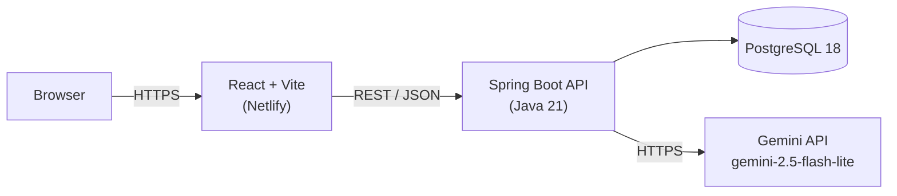

# SplitSmart — Frontend

A group expense splitter that lets you describe spending in plain English
("Rahul paid 500 for dinner") and have AI turn it into structured expenses,
then works out the minimum set of payments needed to settle up.

React + Vite frontend, backed by a Spring Boot API. Built as a learning
project / portfolio piece.

**Live app:** _(add your Netlify URL here once deployed)_
**Backend repo:** [splitsmart-backend](https://github.com/yashika807/splitsmart-backend)

## Screenshots

> TODO — add real screenshots/GIFs here once the full stack is running with
> a few sample expenses in it. A good demo should show: the AI parser turning
> a sentence into expenses, the Trip/Family toggle, and the settlement view.

## Features

- **AI expense parsing** — describe an expense in plain English (English or
  Hindi/English mix), Gemini extracts `{ name, amount }` pairs server-side
- **Manual entry** — a plain form for when you'd rather not type a sentence
- **Trip vs Family toggle** — keep a one-off trip's expenses separate from
  recurring family expenses; each new expense is tagged with whichever tab
  is active
- **Settlement view** — a greedy debt-simplification algorithm reduces
  "who owes who" down to the minimum number of payments
- **Live refetch** — every mutation (add/delete) refetches from the server
  rather than patching local state, avoiding drift between client and DB

## Tech stack

React 19, Vite, React Router 6. No CSS framework — inline styles throughout
(a deliberate simplicity tradeoff for a learning project, see below).

## Architecture



The frontend never talks to Gemini directly — all AI calls are proxied
through the backend so the API key never reaches the browser. See
[What I Learned](#what-i-learned) for why that wasn't always true.

## Getting started

Requires the [backend](https://github.com/yashika807/splitsmart-backend)
running locally (or deployed) first.

```bash
npm install
cp .env.example .env   # set VITE_API_URL if your backend isn't on localhost:8080
npm run dev
```

Opens on `http://localhost:5173`.

### Environment variables

| Variable | Default | Purpose |
|---|---|---|
| `VITE_API_URL` | `http://localhost:8080` | Base URL of the backend API |

## What I Learned

- **Race conditions from optimistic UI updates.** Early versions patched
  local state directly after add/delete, which drifted from the server
  under rapid actions. Switched to refetching the full expense list after
  every mutation — slower, but correct. A good example of "clever" being
  the wrong tradeoff for a small app.
- **React list keys matter even when things "look" fine.** Using array
  index as a `key` worked visually until the list could reorder — switched
  every list to key by stable `expense.id`.
- **Never let API keys touch the client — the hard way.** A Gemini key got
  committed to git history early on. Fixing it meant revoking the key,
  rewriting history with a fresh orphan branch, and rebuilding the AI
  feature so parsing happens entirely on the backend. `.gitignore` only
  protects future commits, not past ones.
- **Hardcoded `localhost` URLs are a deploy trap.** Everything pointed at
  `http://localhost:8080` directly in component code, which works in dev
  and silently breaks the moment the frontend is deployed anywhere else.
  Centralized it into one `config.js` reading `VITE_API_URL`.
- **LLM output isn't guaranteed structure.** Gemini sometimes wraps JSON in
  markdown fences or returns something that isn't the expected shape at
  all. The first version of the AI-parse flow had no error handling for
  this — a bad response would throw partway through and leave the UI stuck
  on a loading spinner forever.
- **Greedy algorithms are a good fit for debt simplification.** Settling
  N people's balances doesn't need N² transactions — sorting debtors and
  creditors and greedily matching the largest amounts against each other
  gets it down to at most N-1 transactions.

## Roadmap

What's actually done vs. not — no aspirational checkmarks.

- [x] Expense CRUD (add / list / delete)
- [x] AI natural-language expense entry, parsed server-side
- [x] Debt-simplification settlement view
- [x] Trip vs Family context toggle
- [x] API keys and DB credentials kept out of source control
- [ ] Backend deployed to a public host — currently local-only
- [ ] User accounts / auth — it's a single shared list, no login
- [ ] Automated tests — none on the frontend yet
- [ ] Input validation (negative/zero amounts, empty names)
- [ ] Backend CORS restricted to the real frontend origin (currently `*`)
- [ ] Custom trip/family names instead of the fixed two-tab toggle
- [ ] Mobile responsive pass
